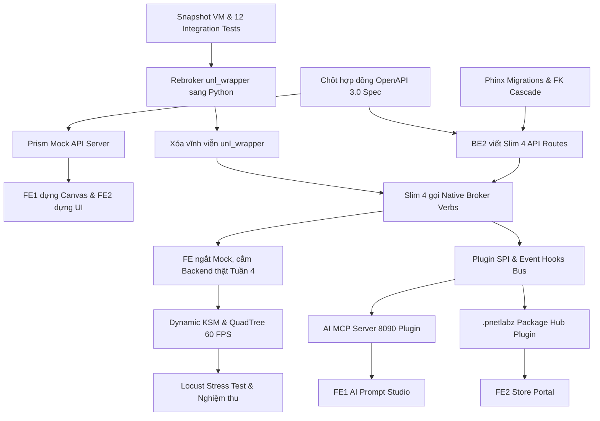

# KẾ HOẠCH TÁI CẤU TRÚC & PHÁT TRIỂN NỀN TẢNG PNETLAB V8
## BẢN KẾ HOẠCH TỐI ƯU 8 TUẦN (2 THÁNG) VỚI SỰ TRỢ LỰC CỦA AI CODING AGENT
### Kèm Ma Trận RACI Chuẩn, Kỷ Luật Kỹ Thuật, Sơ Đồ Phụ Thuộc (Dependency Graph) & Cơ Chế Nghiệm Thu

---

## 📌 I. BỐI CẢNH THỰC THI & NGUYÊN TẮC TỐC ĐỘ CAO

1. **Khung thời gian thực tế**: **8 tuần (2 tháng)** được chia thành **4 Sprints (mỗi Sprint 2 tuần)**.
2. **Quy mô & Định mức Story Points (SP) thực tế**:
   - Nhờ có **AI Coding Agent** hỗ trợ trực tiếp (sinh code boilerplate, chuyển đổi verb hàng loạt, sinh test harness, convert schema, linting), tốc độ phát triển được gia tốc **3x - 4x**.
   - Tổng ngân sách điều chỉnh: **160 Story Points** (chuẩn hóa độ khó thực tế khi có AI).
   - Định mức cá nhân: **40 SP / kỹ sư / 8 tuần** (tương đương **10 SP / kỹ sư / Sprint 2 tuần** = **5 SP / tuần**).
   - Tỷ lệ đóng góp: **Cân bằng 25% cho mỗi thành viên (BE1: 40, BE2: 40, FE1: 40, FE2: 40)**.
3. **Phân tầng tính năng rõ ràng (Scope Tiering)**:
   - **Tầng Bắt Buộc (P0 - Non-negotiable)**: Safety Net Test, Xóa sổ `unl_wrapper`, Slim 4 API, Phinx Migrations, Plugin SPI cơ bản, UI Canvas mượt mà.
   - **Tầng Giá Trị Cao (P1 - Fast-track with AI)**: AI MCP Server (8090), Gói bài lab `.pnetlabz` Hub, Multi-Tenant cơ bản.
   - **Tầng Dự Phòng / Cắt Giảm Linh Hoạt (P2 - Stretch Goal)**: Cyber Range CTF nâng cao, đóng gói ISO tự động (nếu thiếu thời gian sẽ chuyển sang script cài đặt nhanh `install.sh`).
4. **Tuần 8 là Buffer & Nghiệm thu**: Dành 50% thời lượng tuần 8 làm đệm dự phòng rủi ro, không nhận thêm tính năng mới.

---

## 🔗 II. SƠ ĐỒ PHỤ THUỘC KỸ THUẬT (DEPENDENCY CHAIN) - "CÁI NÀO ĐẺ RA CÁI NÀO"

Để tránh tình trạng **chồng chéo**, **làm ngược thứ tự** hoặc **kẻ chờ người đợi**, toàn bộ 8 tuần tuân thủ nghiêm ngặt chuỗi tiền đề 4 tầng:

```
[ TẦNG 0: BẢO VỆ & HỢP ĐỒNG ] ➔ [ TẦNG 1: DỮ LIỆU & LÕI HỆ THỐNG ] ➔ [ TẦNG 2: MỞ RỘNG (PLUGINS & AI) ] ➔ [ TẦNG 3: TỐI ƯU & GIA CỐ ]
```




### 4 Quy tắc Tiền đề Bất biến (Hard Prerequisites):
1. **Safety Net TRƯỚC Rebroker**: Không được sửa 1 dòng code `unl_wrapper` nào trước khi 12 integration tests và 34 smoke tests chạy pass 100%. Nếu không có test, khi sửa code C sang Python hỏng sẽ không biết hỏng ở đâu.
2. **Khóa Hợp đồng API (OpenAPI Contract) TRƯỚC KHI FE làm UI**: Tuần 1 chốt OpenAPI schema. FE dựa vào schema để code với Mock Server, BE dựa vào schema để code Slim 4. Hai bên không đụng chạm nhau, không sợ merge conflict.
3. **Chuẩn hóa Database & Rebroker TRƯỚC Slim 4**: Không thể viết Controllers mới tử tế nếu DB vẫn dùng query thô, thiếu khóa ngoại và `api_nodes.php` vẫn gọi lệnh shell qua `unl_wrapper`. Do đó, DB và Native Broker verbs phải hoàn thiện để Slim 4 chỉ việc tiêm (DI) vào dùng.
4. **Lõi Plugin SPI TRƯỚC AI MCP & Lab Hub**: AI MCP (cổng 8090) và Lab Hub `.pnetlabz` được thiết kế dưới dạng **Plugin độc lập**. Phải có bộ khung nạp Plugin SPI ở Tuần 5 thì Tuần 6 mới cắm 2 module này vào được mà không làm ô nhiễm mã nguồn lõi.

---

## 👥 III. MA TRẬN PHÂN VAI & TRÁCH NHIỆM CHUẨN RACI

> **Quy tắc RACI nghiêm ngặt**:
> - **Chỉ đúng 1 người Chịu trách nhiệm cuối cùng (A - Accountable)** trên mỗi phân hệ.
> - **R (Responsible)**: Người trực tiếp lập trình chính.
> - **C (Consulted)**: Người được tham vấn chuyên môn và phối hợp.
> - **I (Informed)**: Người nhận thông báo kết quả.

| Phân hệ / Hạng mục Kỹ thuật | BE1 (Core) | BE2 (API/Cloud) | FE1 (Canvas) | FE2 (UI/Portal) | Vai trò AI Coding Agent | Người duyệt nghiệm thu (A) |
| :--- | :---: | :---: | :---: | :---: | :--- | :---: |
| **1. Safety Net & Test Harness (Sprint 1)** | **R** | C | C | I | Sinh 12 test fixtures, mock socket | **BE1 (Core Lead)** |
| **2. Retire `unl_wrapper` sang Netlink (Sprint 1-2)**| **R** | C | I | I | Chuyển đổi 12 C switch cases sang Python | **BE1 (Core Lead)** |
| **3. API Slim 4 & Phinx Migrations (Sprint 2)** | C | **R** | C | I | Sinh boilerplate Controller, DI, Schema migration | **BE2 (Backend Lead)** |
| **4. Canvas Engine & WebSocket Realtime (Sprint 1-2)**| I | C | **R** | C | Tối ưu thuật toán QuadTree, Bezier curve | **FE1 (Frontend Lead)**|
| **5. Kiến trúc Plugin SPI & Event Hooks (Sprint 3)** | **R** | C | C | C | Sinh parser plugin.json, event dispatcher | **BE1 (Core Lead)** |
| **6. AI MCP Server (8090) & Lab Hub (Sprint 3)** | I | **R** | C | R | Đóng gói JSON-RPC tools, Tar.gz packager | **BE2 (Backend Lead)** |
| **7. Multi-Tenant Cgroups & Cyber Range (Sprint 4)**| C | **R** | I | R | Cấu hình cgroups v2, dynamic flag daemon | **BE2 (Backend Lead)** |
| **8. Tối ưu Hiệu năng, Đóng gói & Docs (Sprint 4)** | **R** | C | R | C | Tinh chỉnh KSM, sinh docs tự động | **BE1 (Core Lead)** |

---

## 🗓️ IV. LỘ TRÌNH THỰC THI CHI TIẾT 8 TUẦN (4 SPRINTS - 160 SP)

### SPRINT 1 (TUẦN 1 - TUẦN 2): THIẾT LẬP LƯỚI AN TOÀN, CHỐT HỢP ĐỒNG API & REBROKER ĐỢT 1
> **Mục tiêu**: Xây dựng lưới an toàn (Safety Net) để chặn đứng rủi ro; chốt hợp đồng API giúp FE độc lập 100%; chuyển đổi 8 verbs đơn giản đầu tiên.
> **Tổng điểm**: **40 SP** (BE1: 10, BE2: 10, FE1: 10, FE2: 10).

#### Tuần 1: Tạo Lưới An Toàn & Đóng Băng Hợp Đồng API (20 SP)
- **Tiền đề cần có**: Mã nguồn gốc PNetLab v8 đang chạy trên VM Proxmox.
- **Phân công nhiệm vụ**:
  - **BE1 (5 SP)**:
    - Tạo snapshot VM Proxmox (Nested KVM).
    - Sử dụng AI Coding Agent sinh bộ khung PyTest cho Unix Socket `/run/pnetlab/broker.sock`.
    - Viết 6 integration tests đầu tiên cho vòng đời thiết bị: `node_start`, `node_stop`, `node_wipe`.
  - **BE2 (5 SP)**:
    - **Chốt tệp hợp đồng `openapi.yaml`** (OpenAPI 3.0 spec) cho toàn bộ 34 routes hiện hành.
    - Cấu hình Prism Mock Server (port 4010) bàn giao ngay cho FE; cấu hình `phpstan-baseline.neon` cho mã nguồn cũ.
    - Viết 34 automated smoke tests kiểm tra status code của API hiện tại.
  - **FE1 (5 SP)**:
    - Khởi tạo repo Next.js/Vite; sinh TypeScript API client tự động từ `openapi.yaml`.
    - Dựng viewport Canvas 2D mượt mà (Pan, Zoom, Grid background).
  - **FE2 (5 SP)**:
    - Xây dựng Design System tokens (bảng màu, font chữ Inter/Roboto).
    - Dựng trang Authentication (Login, Register) kết nối với Prism Mock Server port 4010.
- **Kết quả nghiệm thu Tuần 1**: Lưới test chạy được; FE có mock API chuẩn spec để làm việc độc lập.

#### Tuần 2: Rebroker Đợt 1 (Zero-Risk) & Đồ Họa Node (20 SP)
- **Tiền đề cần có**: 12 integration tests của Tuần 1 đã xanh; Mock API đã chạy.
- **Phân công nhiệm vụ**:
  - **BE1 (5 SP)**:
    - Rebroker 8 cases đơn giản từ `unl_wrapper` sang hàm Python thuần: `fixpermissions`, `platform`, `ipv6`, `ksmon/off`, `cpulimiton/off`.
    - Hoàn thành 6 tests sinh tử còn lại (KSM toggle, DB backup roundtrip, delete node).
  - **BE2 (5 SP)**:
    - Rebroker `backupdb`/`restoredb` sang Python, loại bỏ hardcode password `mysqldump -ppnetlab`, đọc credentials an toàn từ `/opt/unetlab/data/dbcreds.json` (0600).
    - Khởi tạo project Phinx Migrations; kết xuất dữ liệu baseline MySQL 8.4.
  - **FE1 (5 SP)**:
    - Xây dựng component Node trên Canvas: kéo thả vị trí, icon thiết bị Cisco/Linux/Docker, hiển thị nhãn tên.
    - Xử lý multi-select và bounding box chọn nhiều node cùng lúc.
  - **FE2 (5 SP)**:
    - Xây dựng trang Quản lý bài lab (Lab Management) dạng Grid view và Tree directory.
    - Hộp thoại tạo mới bài lab và cấu hình thông số cơ bản.
- **Cột mốc nghiệm thu M1 (Cuối tuần 2)**: 12 integration tests đạt 100% Pass; 8 verbs của `unl_wrapper` đã chạy qua Python thành công; FE đã có giao diện Canvas kéo thả hoàn chỉnh.

---

### SPRINT 2 (TUẦN 3 - TUẦN 4): NETLINK PYROUTE2, XÓA SỔ UNL_WRAPPER & KẾT NỐI SLIM 4
> **Mục tiêu**: Xóa sổ hoàn toàn file `unl_wrapper`, nâng cấp Slim 4 (Strangler Fig), hoàn thiện nối dây mạng và cắm FE vào Backend thật.
> **Tổng điểm**: **40 SP** (BE1: 10, BE2: 10, FE1: 10, FE2: 10).

#### Tuần 3: Dọn Dẹp Netlink PyRoute2 & Chuẩn Hóa Khóa Ngoại DB (20 SP)
- **Tiền đề cần có**: Đợt 1 Rebroker hoàn tất; Phinx đã cấu hình xong ở Tuần 2.
- **Phân công nhiệm vụ**:
  - **BE1 (5 SP)**:
    - Thay thế case `stopall` trong `unl_wrapper` bằng Python PyRoute2 Netlink API (xóa sạch bridges `vnet*`, `internal*` trong < 2ms thay vì dùng `brctl` thô).
    - Tách logic vòng đời node thành các broker verbs độc lập: `verb_node_start`, `verb_node_stop`.
  - **BE2 (5 SP)**:
    - Viết migration Phinx bổ sung Foreign Keys InnoDB với `ON DELETE CASCADE` (`labs` -> `lab_sessions` -> `node_sessions`).
    - Cài đặt Slim 4 PSR-15 và lớp tương thích `Slim2CompatMiddleware` (bọc PSR-7/15 giả lập giao diện Slim 2 cũ).
  - **FE1 (5 SP)**:
    - Xây dựng tính năng nối dây mạng kéo thả giữa các interface (vẽ đường cong Bezier Curves thời gian thực).
    - Tính toán cổng kết nối khả dụng (available ports) khi kéo dây vào node.
  - **FE2 (5 SP)**:
    - Xây dựng Node Inspector panel (bảng trượt bên phải hiển thị chi tiết CPU, RAM, Image, Slot interface).
    - Context Menu chuột phải trên thiết bị (Start, Stop, Wipe, Console).
- **Kết quả nghiệm thu Tuần 3**: `stopall` dọn sạch mạng không sót rác; DB có khóa ngoại tự dọn session mồ côi; Canvas nối dây mượt mà.

#### Tuần 4: Xóa Vĩnh Viễn unl_wrapper & Di Chuyển API Sang Slim 4 (20 SP)
- **Tiền đề cần có**: Netlink và native broker verbs đã sẵn sàng; Slim2CompatMiddleware đã chạy.
- **Phân công nhiệm vụ**:
  - **BE1 (5 SP)**:
    - Chuyển đổi nốt 4 cases phức tạp (`start`, `stop`, `wipe`, `delete`) sang gọi native broker verbs.
    - **XÓA VĨNH VIỄN tệp `/opt/unetlab/wrappers/unl_wrapper`**. Chạy lại 12 integration tests để chứng minh hệ thống không còn phụ thuộc wrapper cũ.
  - **BE2 (5 SP)**:
    - Di chuyển 34 routes sang Controllers chuyên trách trên Slim 4 có Dependency Injection.
    - Tích hợp Middleware kiểm tra OpenAPI 3.0 schema tự động từ `openapi.yaml`.
  - **FE1 (5 SP)**:
    - Kết nối WebSocket nhận trạng thái node thời gian thực (Xanh: Run, Đỏ: Stop, Vàng: Booting).
    - **Ngắt Mock Server, cắm trực tiếp vào API Slim 4 thật của BE2**.
  - **FE2 (5 SP)**:
    - Modal chỉnh sửa hàng loạt thông số thiết bị (Bulk edit).
    - Bảng cấu hình thuộc tính đường link (delay, jitter, packet loss).
- **Cột mốc nghiệm thu M2 (Cuối tuần 4)**: File `unl_wrapper` bị xóa bỏ hoàn toàn mà test vẫn xanh; 100% API chạy trên Slim 4; FE kết nối trực tiếp với Backend thật thành công.

---

### SPRINT 3 (TUẦN 5 - TUẦN 6): KIẾN TRÚC PLUGIN SPI, AI MCP SERVER & .PNETLABZ HUB
> **Mục tiêu**: Xây dựng bệ đỡ Plugin SPI; đóng gói module AI MCP Server (cổng 8090) và Lab Hub thành 2 plugin độc lập không can thiệp code lõi.
> **Tổng điểm**: **40 SP** (BE1: 10, BE2: 10, FE1: 10, FE2: 10).

#### Tuần 5: Xây Dựng Khung Plugin SPI & AI MCP Server 8090 (20 SP)
- **Tiền đề cần có**: Slim 4 và Broker verbs đã hoàn thiện ổn định ở Sprint 2.
- **Phân công nhiệm vụ**:
  - **BE1 (5 SP)**:
    - Xây dựng lõi `PluginManager` tại `/opt/unetlab/plugins/`; cơ chế nạp metadata `plugin.json` và đăng ký event bus `hook_register('node.pre_start')`.
    - Hỗ trợ cơ chế tự động chạy migration riêng cho plugin (`plugin_<id>_*`).
  - **BE2 (5 SP)**:
    - Đóng gói Plugin AI MCP Server lắng nghe tại cổng TCP 8090 theo chuẩn Model Context Protocol (Anthropic JSON-RPC).
    - Hiện thực 5 tools MCP: `create_topology`, `get_node_status`, `start_node`, `push_running_config`, `read_packet_capture`.
  - **FE1 (5 SP)**:
    - Thiết kế cơ chế Extension Slots trên UI (cho phép plugin nhúng thêm nút bấm, toolbar mà không cần sửa mã giao diện chính).
    - Triển khai thuật toán Auto-Layout (Force-Directed Graph) tự động sắp xếp tọa độ node không chồng chéo dây khi AI sinh topo.
  - **FE2 (5 SP)**:
    - Giao diện Quản lý Plugins (Bật/Tắt, Danh sách, Tải lên tệp ZIP có kiểm tra mã độc).
    - Khung giao diện AI Chatbot Panel nằm cạnh Canvas.
- **Kết quả nghiệm thu Tuần 5**: Plugin SPI nạp thành công; MCP server 8090 nhận lệnh và đọc được trạng thái thiết bị từ PNetLab.
  - **Mở rộng Kiến Trúc - Việc 5.7 (BE2 Lead - Đã hoàn thành)**:
    - **Refactor Toàn Bộ Hệ Thống Monolith Broker Daemon**: Bóc tách tệp nguyên khối `pnetlab-brokerd.py` (từ 7.792 dòng xuống 1.724 dòng, giảm > 78% kích thước) thành các module Clean Architecture phân tầng độc lập trong `scripts/core/`: `extauth_ops.py`, `docker_ops.py`, `telemetry_ops.py`, `cluster_ops.py`, `wireless_ops.py`, `network_ops.py`, `storage_ops.py`.
    - Bảo đảm nguyên tắc Zero-Overhead ($O(1)$ memory dispatch directly over Unix Socket `< 1ms`), Zero-Regression (18/18 Safety Net tests pass 100%).

#### Tuần 6: Đóng Gói .pnetlabz Hub & Hoàn Thiện Tương Tác AI (20 SP)
- **Tiền đề cần có**: Khung Plugin SPI đã chạy; MCP server đã có 5 tools.
- **Phân công nhiệm vụ**:
  - **BE1 (5 SP)**:
    - Tối ưu hàng đợi Staggered Boot Queue (khởi động cách nhau 200ms) trong Broker để chống sụt nguồn (Boot Storm) khi AI tạo lab lớn.
    - Viết 1 Demo Plugin can thiệp sự kiện trước/sau khi bật node để kiểm chứng tính toàn vẹn của Event Hooks.
  - **BE2 (5 SP)**:
    - Đóng gói Plugin Lab Hub; xây dựng Engine nén và giải nén `.pnetlabz` (TAR.GZ chứa topology, configs, giáo trình PDF và mã hash SHA-256).
    - Tích hợp Git Sync Service lắng nghe Webhook tự động kéo đề thi mới từ GitLab/GitHub của trường.
  - **FE1 (5 SP)**:
    - Tính năng Topology Preview (Cho phép xem trước sơ đồ mạng AI sinh ra trước khi bấm Apply vào Canvas).
    - Hiển thị phản hồi từ AI giải thích lỗi cấu hình mạng trực tiếp trên từng thiết bị.
  - **FE2 (5 SP)**:
    - Giao diện PNetLab Store Portal (Duyệt theo danh mục CCNA, CCNP, An toàn thông tin; tính năng 1-Click Import).
    - Hoàn thiện luồng xuất bài lab ra gói `.pnetlabz`.
- **Cột mốc nghiệm thu M3 (Cuối tuần 6)**: Demo cắm/rút 1 plugin mà không sửa 1 dòng code lõi; Demo nhập prompt tiếng Việt tạo topo mạng tự động trên Canvas; Demo tải bài lab từ Hub về chạy ngay.

---

### SPRINT 4 (TUẦN 7 - TUẦN 8): TỐI ƯU HIỆU NĂNG, BẢO MẬT, BUFFER DỰ PHÒNG & NGHIỆM THU
> **Mục tiêu**: Đạt chuẩn hiệu năng 60 FPS cho lab lớn, nén RAM qua KSM, thu hồi sudoers, dành thời gian buffer xử lý phát sinh và bảo vệ đề tài.
> **Tổng điểm**: **40 SP** (BE1: 10, BE2: 10, FE1: 10, FE2: 10).

#### Tuần 7: Tối Ưu QuadTree Canvas, Dynamic KSM & Thu Hồi Sudoers (20 SP)
- **Tiền đề cần có**: Hệ thống đã có đầy đủ chức năng chính từ Sprint 1-3.
- **Phân công nhiệm vụ**:
  - **BE1 (5 SP)**:
    - Triển khai Dynamic KSM Supervisor daemon tự động điều tiết nén RAM (giải phóng 30-50% RAM khi chạy nhiều node vIOS); kích hoạt `io_uring` và phân vùng `tmpfs 8GB`.
    - **Thu hồi quyền sudoers của `www-data`** (xóa bỏ `/etc/sudoers.d/pnetlab`), web server chạy hoàn toàn phi đặc quyền.
  - **BE2 (5 SP)**:
    - Triển khai Middleware phân quyền 4 cấp (RBAC: System Admin, Tenant Admin, Instructor, Student) trên Slim 4.
    - Cấu hình trần hạn ngạch tài nguyên cơ bản qua Cgroups v2 (`memory.max`, `cpu.weight`).
  - **FE1 (5 SP)**:
    - Áp dụng thuật toán QuadTree Viewport Culling trên Canvas – chỉ render các node/link nằm trong tầm nhìn, giữ vững 60 FPS cho lab > 100 nodes.
    - Tối ưu WebConsole nhúng xterm.js đa tab mượt mà.
  - **FE2 (5 SP)**:
    - Giao diện Quản trị Phân quyền người dùng & Nhật ký Kiểm toán (RBAC & Audit Log UI) có gán Trace ID.
    - Tinh chỉnh Dark Mode và hoàn thiện Responsive cho màn hình laptop/tablet.
- **Kết quả nghiệm thu Tuần 7**: Lab 50-100 nodes chạy mượt ở 60 FPS; RAM được nén qua KSM; Web server không còn quyền sudo.

#### Tuần 8: Đệm Dự Phòng Rủi Ro (Buffer), Kịch Bản Cài Đặt & Nghiệm Thu (20 SP)
- **Tiền đề cần có**: Codebase đã đóng băng tính năng từ Tuần 7; 50% thời gian dành cho việc sửa lỗi và tinh chỉnh.
- **Phân công nhiệm vụ**:
  - **BE1 (5 SP)**:
    - Viết script `pnet-doctor` tự động kiểm tra phần cứng KVM, socket, cgroups v2, RAM.
    - Đóng gói kịch bản cài đặt tự động `install.sh` / triển khai thử nghiệm trực tiếp trên máy chủ Proxmox thật của nhà trường.
  - **BE2 (5 SP)**:
    - Chạy kịch bản Locust Stress Test (giả lập 30-50 người dùng đồng thời, 200 API req/s).
    - Hoàn thiện tài liệu kiến trúc kỹ thuật (ADRs, Database Dictionary, OpenAPI spec).
  - **FE1 (5 SP)**:
    - Chạy toàn bộ Playwright E2E Test Suite kiểm tra tự động các luồng thao tác người dùng.
    - Tinh chỉnh các lỗi đồ họa nhỏ; tối ưu điểm hiệu năng Lighthouse.
  - **FE2 (5 SP)**:
    - Hoàn thành Sổ tay Hướng dẫn Sử dụng cho Giảng viên & Sinh viên.
    - Chuẩn bị slide báo cáo, video demo các mốc kỹ thuật và biên bản bàn giao.
- **Cột mốc nghiệm thu M4 (Cuối tuần 8 - Final Defense)**: Báo cáo bảo vệ đề tài trước Giảng viên hướng dẫn; demo trực tiếp hệ thống vận hành trên máy chủ Proxmox.

---

## 🔍 V. QUY TRÌNH REVIEW CHÉO & KIỂM SOÁT CHẤT LƯỢNG THỰC TẾ

### 1. Quy định Review Chéo (Peer Review Rule)
Để đảm bảo code được soi kỹ cả về **chuyên môn sâu** lẫn **tính tương thích hệ thống**, mọi Pull Request (PR) bắt buộc phải có **2 lượt phê duyệt**:
- **1 Reviewer Cùng mảng (Chuyên môn sâu)**:
  - Code Python/Hệ thống của **BE1** ➔ **BE2** review logic, ngoại lệ, socket call.
  - Code PHP/DB/API của **BE2** ➔ **BE1** review bảo mật, truy vấn, hiệu năng.
  - Code Canvas/Engine của **FE1** ➔ **FE2** review cấu trúc component, state.
  - Code UI/Portal của **FE2** ➔ **FE1** review hiệu năng render, design system.
- **1 Reviewer Khác mảng (Tương thích giao tiếp)**:
  - PR Backend phải có **FE1 hoặc FE2** duyệt để xác nhận hợp đồng dữ liệu API/WebSocket không bị lệch.
  - PR Frontend phải có **BE1 hoặc BE2** duyệt để xác nhận tải gửi lên backend đúng chuẩn.

### 2. Tiêu chuẩn Kiểm toán Mã nguồn với PHPStan Baseline
- **Không ép level 8 ngay trên code cũ**: Tạo tệp `phpstan-baseline.neon` để tạm bỏ qua các lỗi cũ của mã nguồn EVE-NG tàn dư.
- **Yêu cầu với code mới**: Toàn bộ các file Controllers, Services mới viết trong Slim 4 phải vượt qua **PHPStan Level 8 không cảnh báo**.

---

## ⚠️ VI. BẢN QUẢN LÝ RỦI RO KỸ THUẬT & PHƯƠNG ÁN DỰ PHÒNG (CONTINGENCY PLAN)

| STT | Rủi ro Kỹ thuật Tiềm ẩn | Mức độ | Dấu hiệu phát hiện sớm | Kế hoạch Ứng phó & Phương án B |
| :---: | :--- | :---: | :--- | :--- |
| **1** | **Xung đột Netlink PyRoute2**<br>(Tạo/xóa bridge ảo bị kẹt kernel) | Cao | Test case `stopall` chạy > 10ms hoặc sót veth | **Phương án B**: Bọc fallback gọi CLI `ip link del` an toàn qua subprocess có timeout 2s trước khi debug sâu. |
| **2** | **Cgroups v2 không đồng nhất**<br>(Nhân Linux máy chủ trường chưa kích hoạt) | Trung bình | `pnet-doctor` báo thiếu controller memory/cpu | **Phương án B**: Hạ cấp xuống giám sát qua process polling thông thường, không chặn cứng luồng chạy lab. |
| **3** | **Lệch pha Mock API và Backend**<br>(Frontend vẽ xong nhưng gọi API thật lỗi) | Cao | API trả về mã 422 hoặc 500 khi đổi mock | **Đã phòng ngừa**: Chốt `openapi.yaml` từ **Tuần 1** và cắm API thật ngay từ **Tuần 4**, không để dồn đến cuối dự án. |
| **4** | **Quá tải tiến độ ở Sprint 4**<br>(Không kịp làm Cyber Range CTF hoặc ISO) | Trung bình | Tuần 6 chưa xong lõi Plugin SPI | **Kế hoạch Cắt Giảm**: Cyber Range là tính năng P2 ➔ Giữ ở mức Demo cờ tĩnh; Bộ cài ISO thay bằng script `install.sh`. |

---

## 📊 VII. MẪU BÁO CÁO & XÁC NHẬN NGHIỆM THU ĐỊNH KỲ

### 1. Bảng Cập Nhật Tiến Độ Hàng Tuần (Gửi Thầy mỗi Thứ Hai)

```markdown
BÁO CÁO TIẾN ĐỘ TUẦN ..... - DỰ ÁN PNETLAB V8
Thời gian: Từ .../... Đến .../... | Trạng thái: [ ] Xanh (Đúng hạn)  [ ] Vàng (Cần lưu ý)

1. TỔNG HỢP TIẾN ĐỘ:
- Điểm Story Points hoàn thành trong tuần: ..... / 20 SP (Tích lũy: ..... / 160 SP)
- Tình trạng kiểm thử: ..... Tests Pass | PHPStan New Code: 0 Lỗi | Flake8: 0 Lỗi

2. KẾT QUẢ TỪNG THÀNH VIÊN KÈM MINH CHỨNG SỐ:
+ BE1: [Nhiệm vụ] ➔ Trạng thái: Xong | Minh chứng: PR #... (Đã merge), Test log pass.
+ BE2: [Nhiệm vụ] ➔ Trạng thái: Xong | Minh chứng: PR #... (Đã merge), OpenAPI schema.
+ FE1: [Nhiệm vụ] ➔ Trạng thái: Xong | Minh chứng: PR #..., Video demo Canvas 60 FPS.
+ FE2: [Nhiệm vụ] ➔ Trạng thái: Xong | Minh chứng: PR #..., Screenshot UI hoàn thiện.

3. VẤN ĐỀ CẦN XIN Ý KIẾN THẦY:
- (Ghi ngắn gọn các vướng mắc kỹ thuật hoặc đề xuất điều chỉnh nếu có)
```

### 2. Biên Bản Nghiệm Thu Sprint (Mỗi 2 tuần 1 lần)
Mỗi mốc Milestone (M1: Tuần 2, M2: Tuần 4, M3: Tuần 6, M4: Tuần 8) đều có biên bản nghiệm thu ngắn gọn gồm:
1. Kết quả chạy tự động của Test Suite (Pass Rate).
2. Demo tính năng trực tiếp trước Thầy trong 15 phút.
3. Chữ ký xác nhận nghiệm thu đạt yêu cầu để chuyển sang Sprint tiếp theo.
